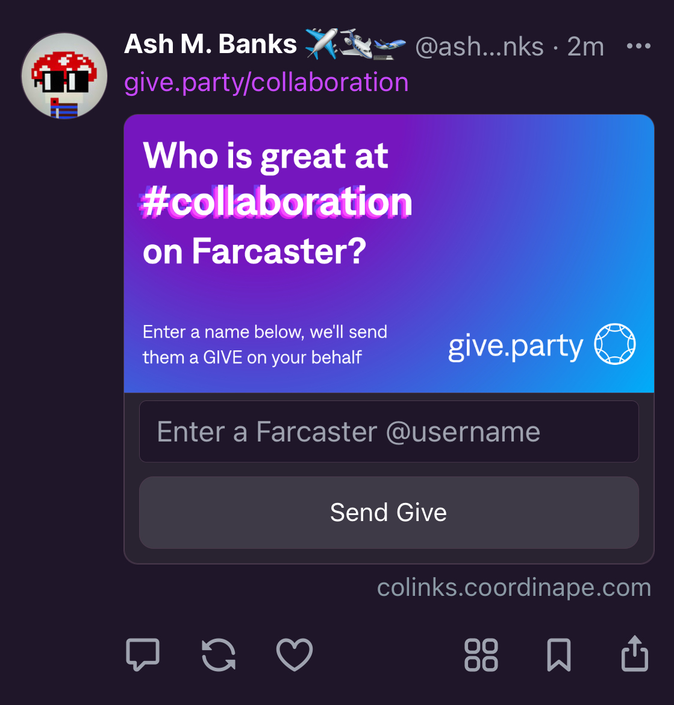
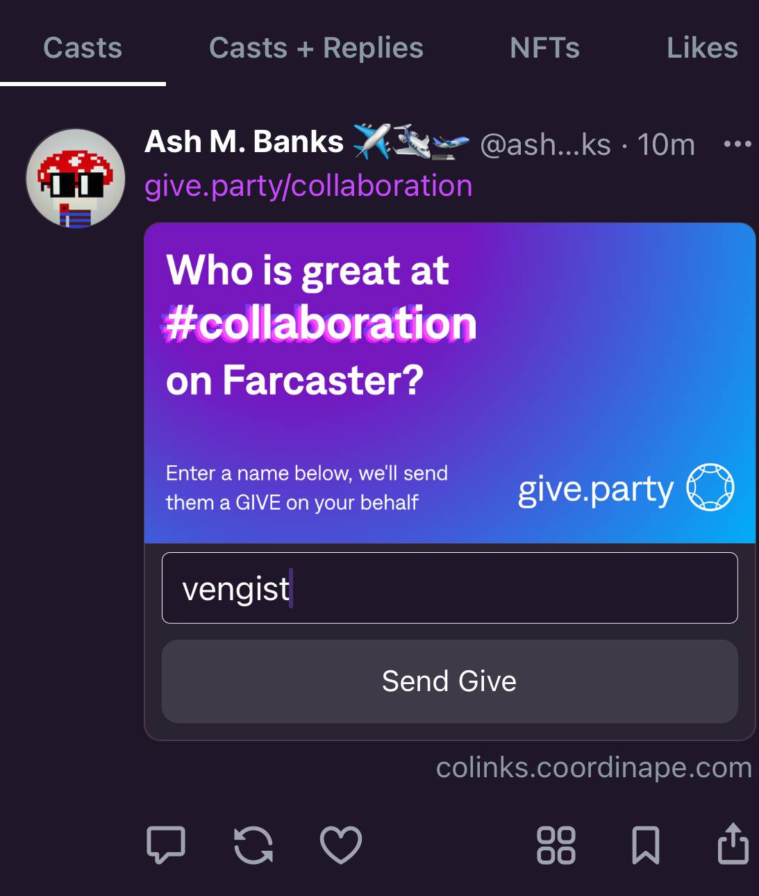
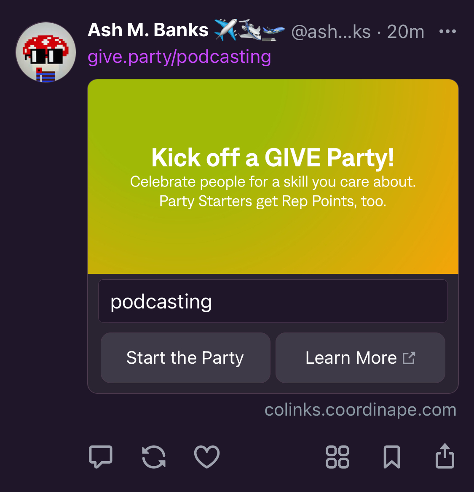
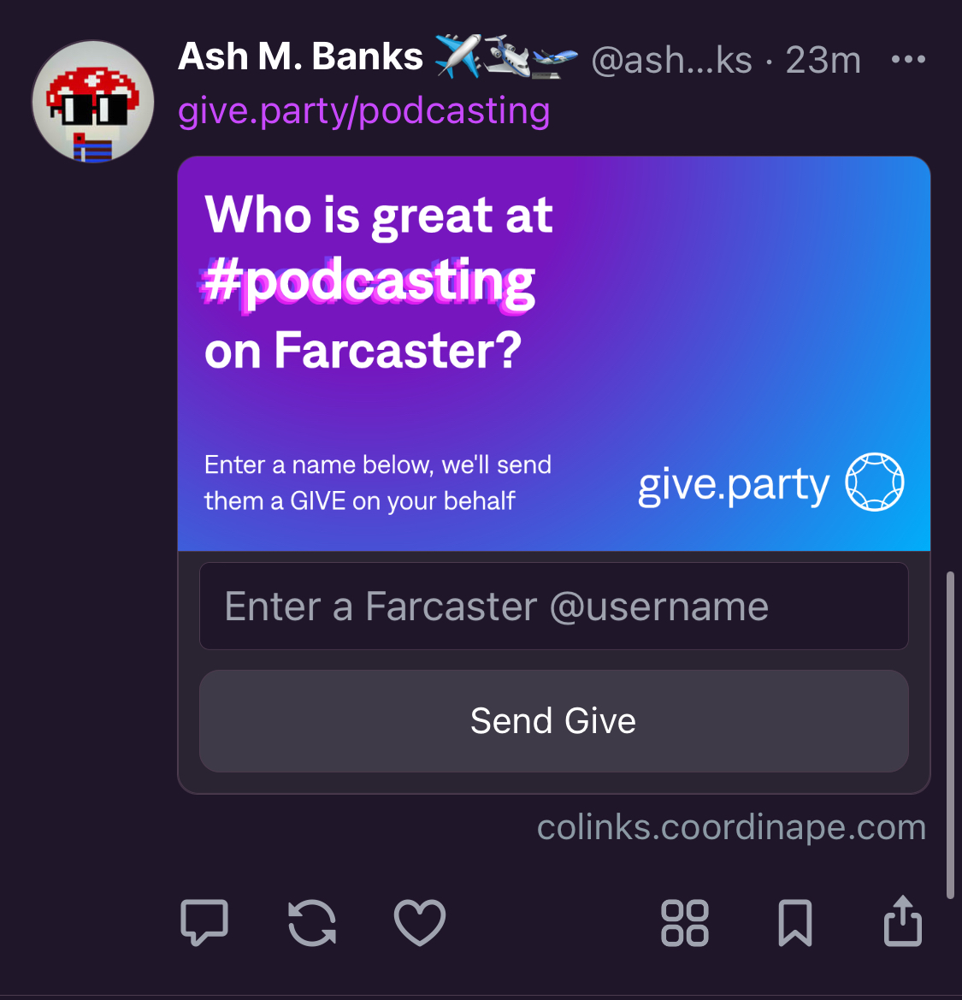
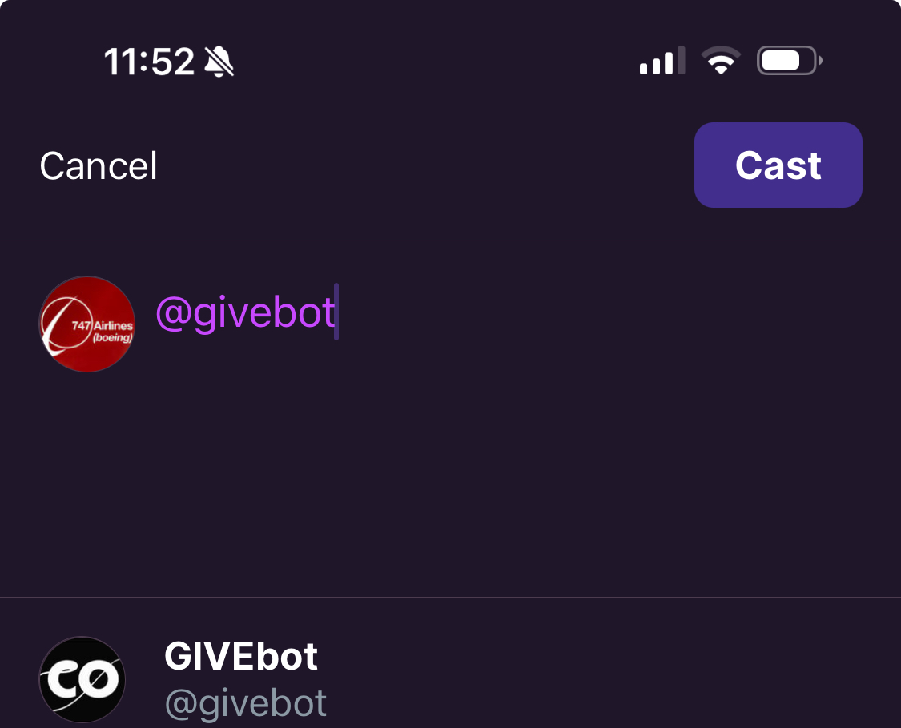
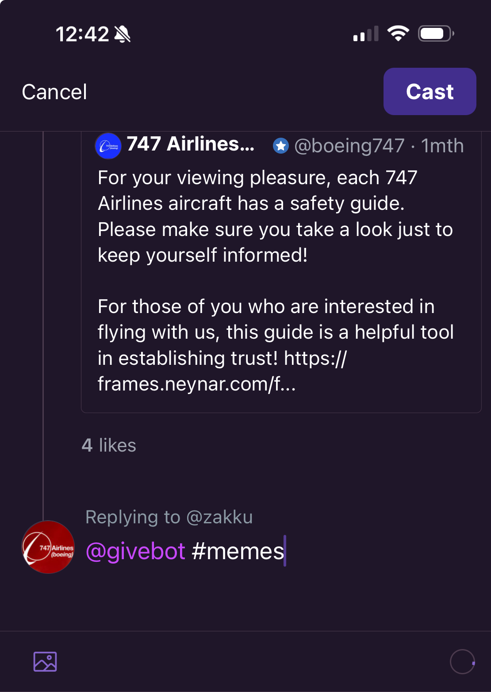
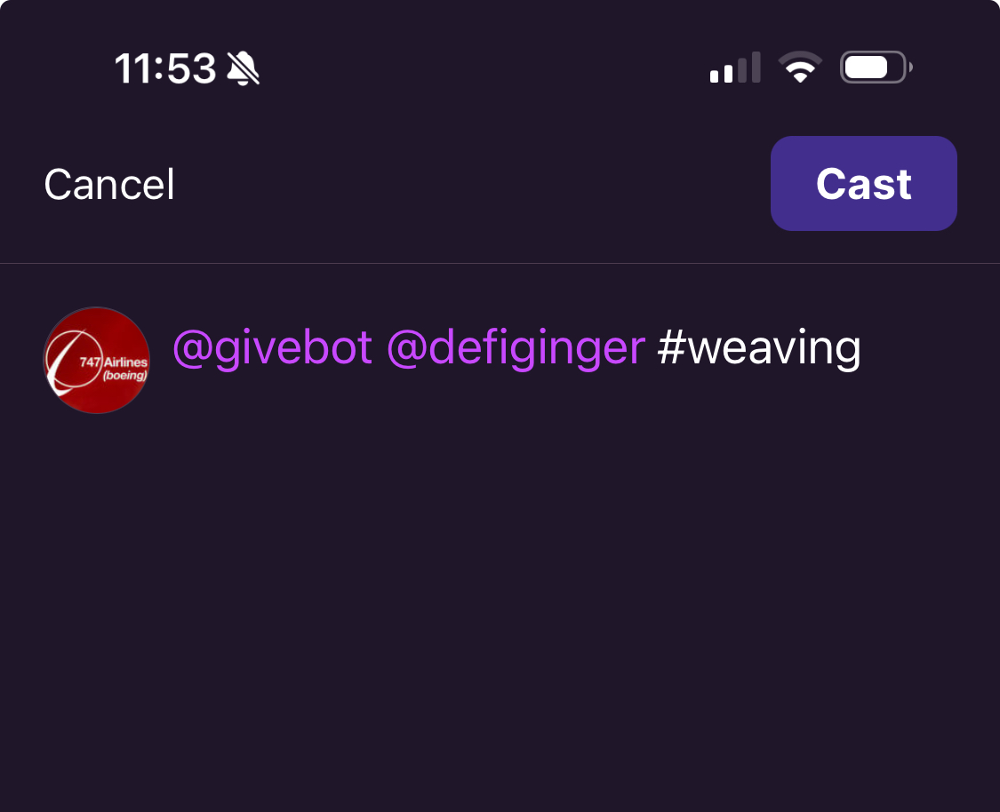
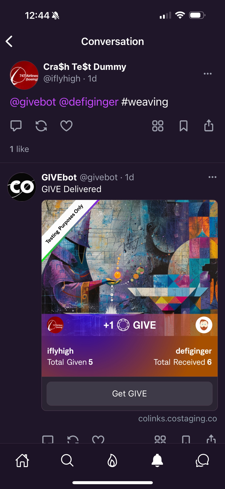

# GIVE

## What is GIVE?

* A simple and powerful way to recognize people and impact, inside and outside of the Coordinape platform.
* All ways and forms of giving GIVE are stored onchain as markers in time that someone was recognized for something great. GIVE is stored as pGIVE on the [Coordinape member’s CoSoul.](http://coordinape.com/cosoul)
* You can give GIVE to anyone on Farcaster or [CoLinks](https://colinks.coordinape.com) to recognize them.
* You can [allocate GIVE in Coordinape Gift Circles](https://docs.coordinape.com/get-started/get-started) to recognize and reward value contributed by circle members.

## [GIVE.party](https://give.party)

<figure><figcaption>
Start a party with 
</figcaption></figure>

1. Cast "give.party/ `{a-skill-you-want-to-celebrate}`" to start a Give Party\
   (Where you replace `{a-skill-you-want-to-celebrate}`  with your chosen skill to celebrate.)\
   \
   \*\*\***NOTE: Due to Warpcast's  assertive prefetching, this works best if you paste the URL for your party into your cast.** [**You can also go straight to give.party in your browser and use our PARTY STARTER!**](https://give.party)\

2. Anyone on Farcaster can use the frame that shows up to name people who they think are awesome at that skill.

<figure><figcaption>
Who do you want to GIVE to for having this skill?
</figcaption></figure>

3. Givebot will make sure your GIVE is delivered!\

<figure><figcaption></figcaption></figure>

4. You can GIVE to more people in the party, or start your own party by clicking "**How 2 Party"**\

<figure><figcaption>
Send more OR click "How 2 Party" to start your own GIVE party.
</figcaption></figure>

5. Simply input the skill that you want to start the GIVE party about and we'll prep a cast with the party frame for you.&#x20;

<figure><figcaption>
Start a party here
</figcaption></figure>

<figure><figcaption>
PARTY is started!
</figcaption></figure>

5. Party Starters will get Coordinape Rep Points for their parties! Every party gets a little, really big parties get a lot.

## GIVE in CoLinks, Farcaster, and Warpcast

Your GIVE balance increases by 1 per day, and in the future will be increased at a higher rate for those with higher Rep. GIVE balance is viewable in CoLinks in the top right corner of your CoLinks Home page.

<figure><figcaption></figcaption></figure>

You can GIVE on any post to give to another CoLinks member by clicking the “GIVE” button:

<figure><figcaption></figcaption></figure>

Then select or write a tag, or choose “Just GIVE”:

<figure><figcaption></figcaption></figure>

The GIVE will be reflected on the post:

<figure><figcaption></figcaption></figure>

## **Giving GIVE in Farcaster and Warpcast**

You can give in Warpcast by mentioning the `@givebot` , and it will deliver the GIVE to the recipient for you.

<figure><figcaption></figcaption></figure>

### **As a Reply Cast:**

`@givebot` as a reply cast to another cast, and Givebot will deliver a GIVE to the original caster from you.

<figure><figcaption></figcaption></figure>

### **As a new Cast:**

Givebot responds to format `@givebot @user #skilltag`

When giving from a new cast, you need to @mention another user as the recipient.

The `#skilltag` is an optional way to add more context to the GIVE so others know more about why you want to recognize someone, adding to their onchain reputation history.

<figure><figcaption></figcaption></figure>

You should see the Givebot respond with a message that the GIVE was delivered and a Frame that welcomes you into the GIVE app.

<figure><figcaption></figcaption></figure>
