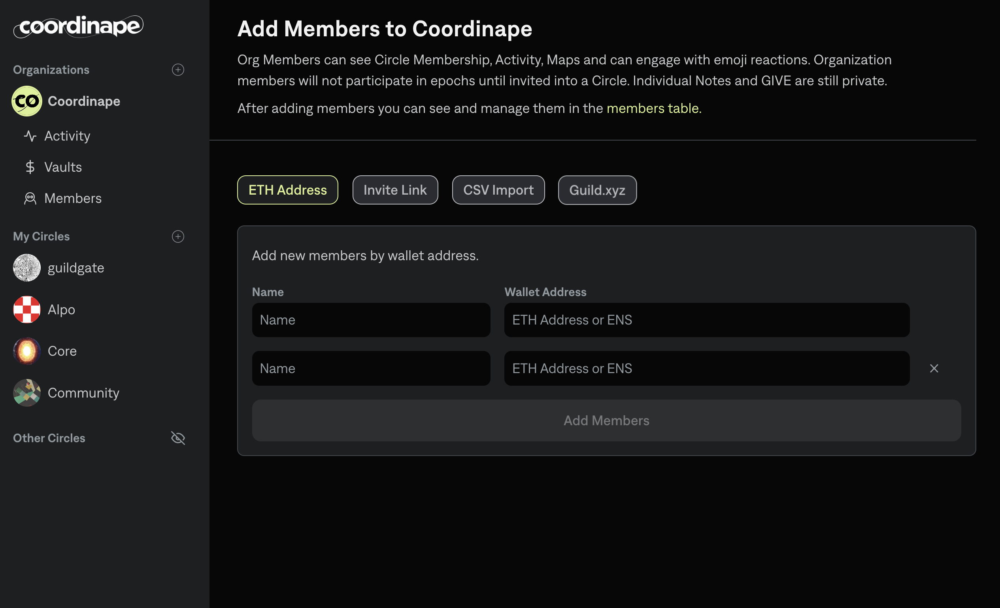
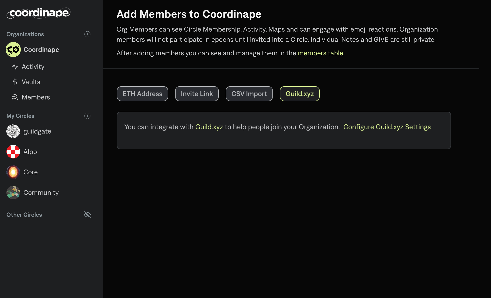
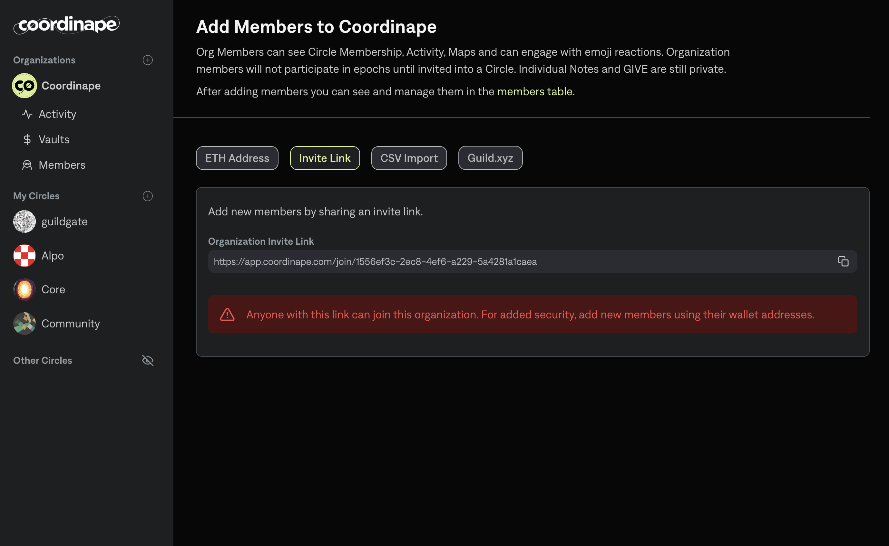

# Managing Organization Membership

### What Org Members Can Do

Org membership enables higher transparency and increased engagement, by allowing all members to observe and emoji react to activity happening in the org.

### What Org Members Can See

* Activity Feeds of Circles and at the Org level
* Circle Membership rosters
* Circle Maps (which show epoch results)
* Org Vaults and Vault balances
* Profile pages of other Org Members

### What Org Members Cannot See

* Wallet addresses
* Admin Screens
* Allocation Views

## How to Invite Org Members

Circle Admins within the org have the right to invite members into the Org, via the Org membership list.

<figure><figcaption>
Org Members List
</figcaption></figure>

### Invitation Methods:

#### 1. Manual Invitation

Just like adding circle members, admins can invite members to the Organization with their wallet address or ENS.&#x20;

<figure><figcaption>
Manual Invitation
</figcaption></figure>

#### 2. CSV Import

Import a CSV list of your members with 2 columns: Name, Address

<figure><figcaption>
CSV Import
</figcaption></figure>

#### 3.Token Gating with Guild.xyz

Use [Guild.xyz](https://guild.xyz/) to create custom token gating rules for your Organization. \
_\*Note - Membership requirements are only checked at the time that the member uses the custom Guild invite link to enter the Org. Token ownership status is not checked in an ongoing basis. In other words, if a member who has joined through Guild requirements no longer has the Guild required token(s), Coordinape will NOT remove them from your Organization._

<figure><figcaption>
Guild.xyz
</figcaption></figure>

#### 4. Invite Link

The most open way to allow members to join is to use an Invite Link. The invite link allows anyone with the link to enter your Organization.

<figure><figcaption></figcaption></figure>

## Removing Org Members&#x20;

Circle admins can remove members from the Org Members page as long as the member is not a member of any circles.&#x20;

<figure><figcaption></figcaption></figure>
