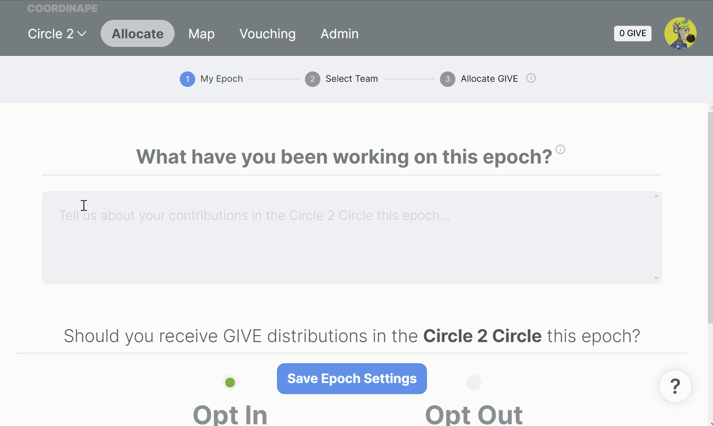

# Record Contributions

### My Epoch

An Epoch is quite simply a period of time. Admins can set Epochs for up to 100 days. During an Epoch, You can reflect on your contributions. Contributions can be for the current period of time or a prior period of time, as long as your whole Circle knows when the contributions are&#x20;

### Your Contributions

At the beginning of each Epoch, your circle will ask you to answer two questions, which will help your colleagues determine how to GIVE to you.



Your statement is public for anyone in the Circle and will show up on your card during the allocation phase for other users to view.

.png>)

The Epoch Statement details the work you have done this month or clarifies work that the DAO wants to compensate.

\
**Best Practices**\
It's best to summarize your work so that anyone from your team can understand what you did and its impact/goal. Quantify your work where ever possible for better understanding.

\
**Examples**

* Created the marketing plan for Coordinape, sent 6,000 tweets, and received 12,000 RTs
* Pushed 6 Github issues to allow us to unblock back-end work and resolve bugs impacting the user.
* Redesigned the landing page to guide users to the valuable part of our docs easier



**Opt-Out**

If you _Opt-Out_, you are signaling that you have other income streams in your Circle sufficient for you, and Coordinape should not compensate your work. **It will be impossible for others to give to you.**

**Opt-In**

If you _Opt-In_, you will be able to receive GIVE. You may use the Profile Statement to detail why.

**Settings**

You can change settings throughout the Epoch or future Epochs by accessing your profile on the Allocate Page to change them. \\

For example, if you change your status to Opt-Out after receiving GIVE during an epoch, any GIVE you have accrued will return to its senders.

**Admin Override**

It is also possible that your circle admin may force you to opt-out if you are not eligible to receive GIVE.\
\
For more information, click here 👇


[give](../../give/)



