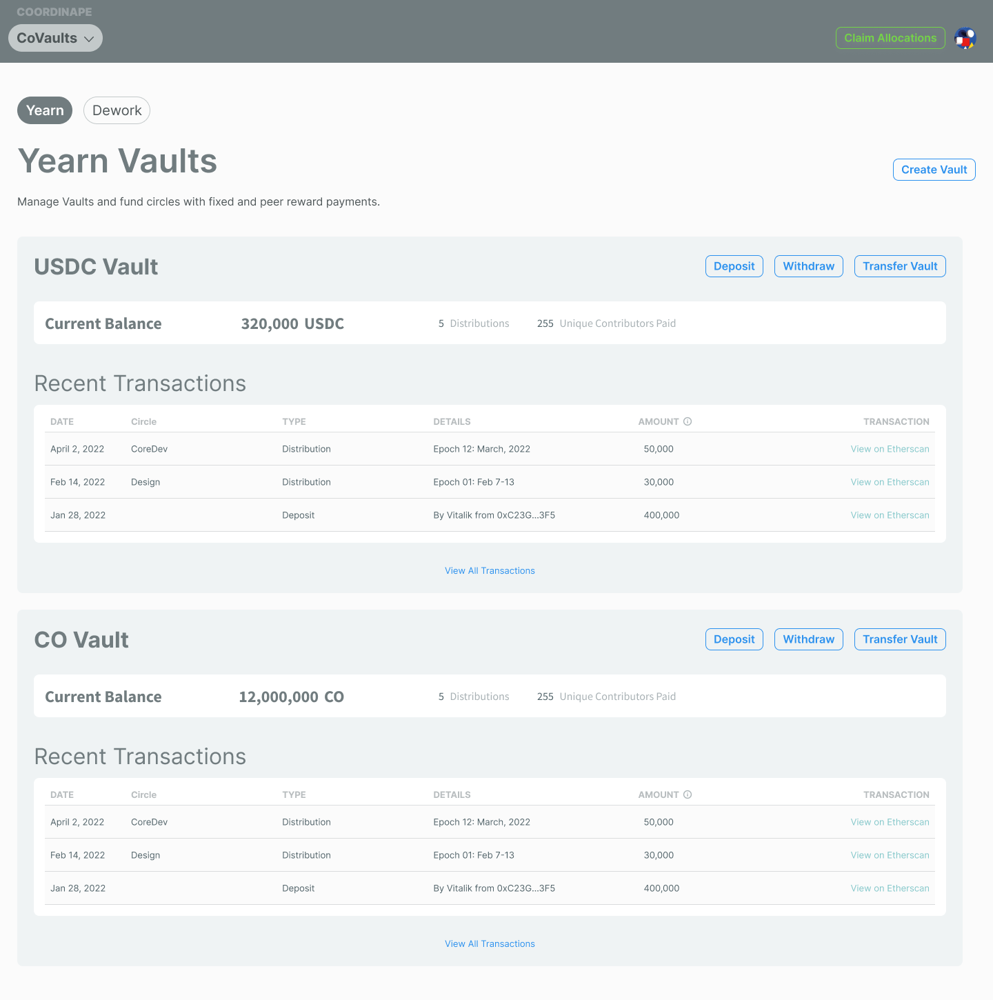

# 🔒 CoVaults

CoVaults allow you to compensate your team by storing funds in the vaults and sending payments promptly after a work cycle [(Epoch)](../../epochs/) ends. Anyone can fund a vault in your organization, which is perfect for fundraising via proposals or grants. In addition to paying your team, you can earn [interest based on the current APYs offered by Yearn](https://docs.yearn.finance/getting-started/products/yvaults/overview). Vaults also enable you to set allowances for distributions per Circle.

## CoVaults Benefits

By using Coordinape Vaults, you can skip exporting the CSV from Coordinape to execute batch payments with external tools, so the team will quickly be paid with funds from the vault after an Epoch. Also, if you choose a Yearn Vault, you will earn interest on top of your funds at Yearn market rates.

Contributors are happy to receive prompt payment, and the organization earns yield. WIN-WIN!

### All in One Place

Instead of managing multiple vaults and treasury management systems on top of Coordinape GIVE Circle, You can set aside funds for the work cycle [(Epoch) ](../../epochs/)and send compensation to your team promptly after reviewing GIVE allocations.


[managing-the-vault.md](managing-the-vault.md)


### Fixed Payments

You can now set fixed salaries for your team members so everyone can receive base compensation in addition to the GIVE Circle results. Instead of your members entirely depending on the GIVE circle to compensate for their efforts, they can receive peace of mind knowing they will get at least a base salary.


[fixed-payments.md](../../compensation/paying-your-team/distributions-and-payments/fixed-payments.md)


### Getting Yield

Before you start your next work cycle[ (Epoch)](../../epochs/), you can set aside and store funds for payroll in a CoVault. Just create a vault for your organization and determine which asset you want to compensate your team to get started. Then, choose the Yearn Vault option to earn interest.

Once a vault reflects a positive balance, they begin to earn Yearn APY rates.

[**View Yearn's Current Rates** ](https://yearn.finance/vaults)****

### Transparency

Contributors are often wary about working on projects due to the promise of compensation via retroactive payment. You can give your contributors peace of mind by funding a CoVault before you start a work cycle [(Epoch).](../../epochs/) Then, contributors can see funds in the Vault and do their best work, knowing they will receive payment.

## Limitations

Once Circle Admin creates a vault, only the creator of the Vault can manage the funds in the Vault.

### Only Vault Owners can:

* Send Payments
* Withdrawal Funds
* Transfer Ownership

Once the work cycle [(Epoch)](../../epochs/) has ended, admins cannot edit payments from the GIVE Circle. Additionally, circle Admins cannot send funds to other protocols or contracts from vaults.

See [coordinape-vaults.md](../../../info/documentation/coordinape-vaults.md "mention") for more technical information.
