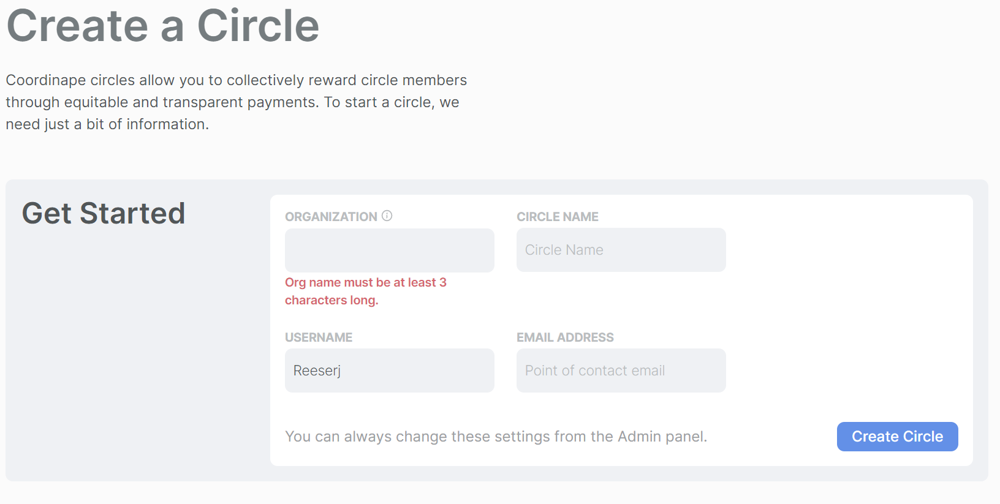

# Discord Bot

Coordinape was built initially for Yearn Finance, a DAO that heavily uses Telegram. Hence, our bot features have been centered around that platform. Now, we've begun to port our bot to Discord, and added easy webhook integration functions to the Coordinape admin panel. Read on for an overview and how to set it up. More features will be added to the bot over time.

### What can the Discord Bot do?

* Caesar can let your discord know when a users has opted out of a current epoch, and how much give was refunded.

* Inform users that an epoch is active

.jpg>)

* Let users know when the epoch ends

### How to add "Caesar" the discord bot to your teams Discord Channel

1. Click **Edit Channel** on the channel where you want Coordinape notifications to appear. 
2. Go to I**ntegrations** -> **View Webhook**
3. .jpg>)\
   \\
4. Create **New Webhook** and **Name it** "Coordinape" _(Naming isn't required but it will help your users know where the notifications are coming from)_ click on **Copy Webhook URL**\
    (1) (2).png>)

4\. Go to Coordinape Circle where you're an Admin and click the **Admin Tab** and scroll to the Integration section and click Edit Webhook

<figure><figcaption></figcaption></figure>

5\. **Paste the webhook url** from the Discord bot into text field and **click save**&#x20;

#### BOOM! You now have Caesar helping you keep track of active Epochs, giving you a heads up when users make allocations, and letting you know if a user opts out. We'll be adding features to the bot over time, but in the meantime we hope you enjoy this functionality!

If you appreciate this make sure to let Zashton know!

_You may need to enter developer mode in discord to add the bot_

__

## New Discord Bot

To add the bot to your server click this link [https://discord.com/api/oauth2/authorize?client\_id=1081300551947538533\&permissions=8\&scope=bot](https://discord.com/api/oauth2/authorize?client\_id=1081300551947538533\&permissions=8\&scope=bot)  and then&#x20;

.png>)

Once the bot has been added to your discord use the `/coordinape config` command click **link** account.&#x20;

.png>)

once you've linked your account, you will have the option to configure the bot by using the `/Coordinape Config` command and clicking the configure button.

.png>)

You can then follow the prompts provided by the bot to finish configuring the bot.&#x20;



After adding the Bot to your server you can select which Circles to enable in this server.&#x20;

<figure><figcaption></figcaption></figure>


The bot will query your account and will display all Circles you administer. This could include circles across different Orgs so be mindful when selecting circles.


1. Click the Dropdown
2. Select the Circles from the drop down
3. Click the input box again
4. Click `Next`

The Bot will create a Channel, and a Role for each Circle in your Discord and then send this message:&#x20;

<figure><figcaption></figcaption></figure>

This will ensure the Bot sends the correct alerts and gets the correct commands for each circle in their respective channels

After clicking next navigate to your new channels and click `Link Circle` Button and then click the `Authorize` button

<figure><figcaption></figcaption></figure>

This will take you to Coordinape to retrieve your API key for the circle.&#x20;

Once that's complete the bot will ask you if you want it to send alerts for your Circle.&#x20;



Once you've linked your Circles you will be prompted to set up alerts in your circle. &#x20;

<figure><figcaption></figcaption></figure>

| Alert                | Description                                                            |
| -------------------- | ---------------------------------------------------------------------- |
| Epoch Start          | Alerts when an Epoch starts                                            |
| Epoch End            | Alerts when an Epoch ends                                              |
| Nomination           | Alert when a user is Nominated for a Circle                            |
| Vouch                | Alert when a user vouches for a Nominee                                |
| Vouch Successful     | Alert when a user is successfully vouched into a circle                |
| Vouch Unsuccessful   | Alert when a user is not successfully vouched into a circle            |
| User Added to Circle | Alert when a user is added to a circle                                 |
| User Leaves a Circle | Alert when a User leaves a Circle                                      |
| User Opts out        | Alert when a User opts out of receiving Give from other Circle Members |



